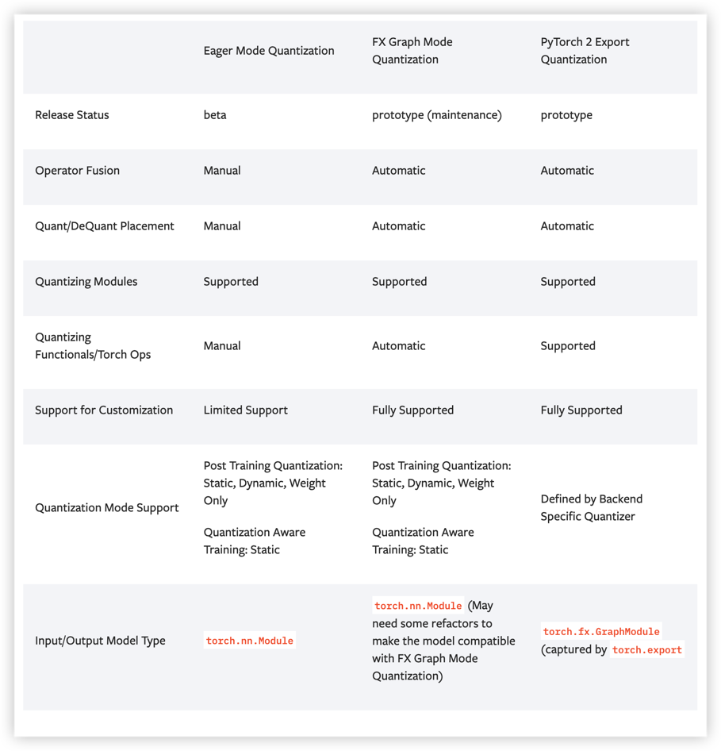
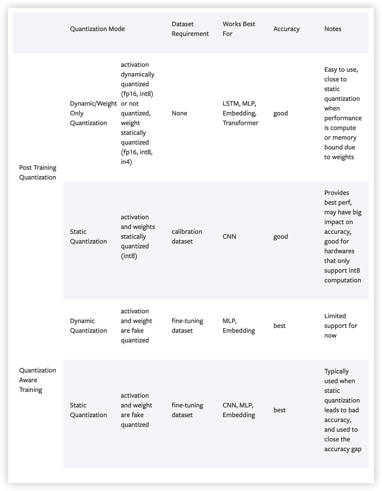
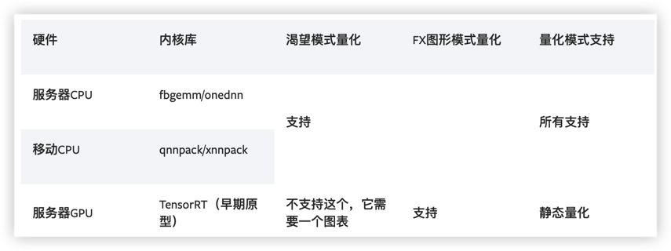

## 当前模型量化的开源工具
模型量化属于模型优化中的重要技术之一，是非常有效的提升模型推理速度的技术方案，目前开源的模型量化工具如下：
1. Tensorflow Lite  
Tensorflow Lite是谷歌推出的面向嵌入式设备的推理框架，支持float16和int8低精度，其中8bit量化算法细节可以参考
白皮书“Quantizing deep convolutional networks for efficient inference: A whitepaper”，支持训练后
量化和量化感知训练，这也是大部分量化框架的算法原理。  
git地址：https://github.com/tensorflow/model-optimization
2. TensorRT  
TensorRT是Nvidia提出的神经网络推理引擎，支持训练后8bit量化，它使用基于交叉熵的模型量化算法，通过最小化两个分布
的差异程度来实现。  
git地址：https://github.com/NVIDIA/TensorRT  
caffe-int8-convert-tools是一个Caffe模型量化工具，基于TensorRT2.0。
git地址：https://github.com/BUG1989/caffe-int8-convert-tools
3. CoreML  
CoreML是iOS系统提供的机器学习核心框架，其可以将训练好的模型轻松的集成到我们的应用中，至于模型，可以使用自己训练的，
也可以使用三方训练好的，甚至可以将其他框架的模型转换成CoreML所需的类型进行使用。该框架也支持支持训练后 量化和量化
感知训练。  
git地址：https://github.com/kingreza/quantization  
具体内容可参考官网信息：https://developer.apple.com/machine-learning/models/
4. PaddleSlim  
PaddleSlim是百度提出的模型量化工具，包含在PaddlePaddle框架中，支持量化感知训练，离线量化，权重全局量化和通道级别
量化。  
git地址：https://github.com/PaddlePaddle/models/tree/develop?tab=readme-ov-file
5. Pytorch  
Pytorch1.3开始已经支持量化功能，基于QNNPACK实现，支持训练后量化，动态量化和量化感知训练等技术。  
git地址：https://github.com/pytorch/QNNPACK  
另外Distiller是Intel基于Pytorch开源的模型优化工具，自然也支持Pytorch中的量化技术。  
git地址：https://github.com/IntelLabs/distiller
6. 其他框架  
微软的NNI集成了多种量化感知的训练算法，并支持PyTorch，TensorFlow，MXNet，Caffe2等多个开源框架。  
地址：https://github.com/microsoft/nni  
keras: git地址：https://github.com/google/qkeras  

## PyTorch量化
> 官网标明：量化处于测试截断，可能会发生变化

介绍：https://pytorch.org/blog/introduction-to-quantization-on-pytorch/  
官网文档：https://pytorch.org/docs/stable/quantization.html  
教程：https://pytorch.org/tutorials/advanced/dynamic_quantization_tutorial.html  
中文版教程：https://pytorch.apachecn.org/2.0/tutorials/intermediate/dynamic_quantization_bert_tutorial/

### 量化模式
PyTorch提供三种不同的量化模式：
* Eager Mode Quantization
  * 测试版功能
  * 需要手动进行融合，并指定量化和反量化的位置
* FX Graph Mode Quantization
  * 维护
  * 自动化量化流程
  * Pytorch是基于**动态图**执行模型的深度学习框架，虽然提升了用户的易用性，但是在一些真实场景中
    用户可能需要**捕获和变换**程序结构(也可以直接理解为神经网络的结构)来进行性能优化、可视化、分析
    和硬件调试等。为了解决这个痛点，Pytorch设计了torch.fx这个模块来做Pytorch程序的捕获和
    变换。
  * 可参考论文：https://arxiv.org/pdf/2112.08429.pdf
* PyTorch 2 Export Quantization
  * 新的全图形模型量化工作流程
  * 更好的完整程序捕获解决方案(torch.export)，捕获更高的模型百分比与torch.fx.symbolic_trace
  * torch.export在一些python结构方面仍有局限性，需要用户参与以支持导出模型的动态
  * 优势：
    * 可编程API用于配置模型的量化方式，可以扩展到更多用例
    * 简化了UX，用于模型使用者和后端开发人员，因为他们只需要与单个对象(Quantizer)交互
    * 可选的参考量化模型表示，可以用整数运算来表示量化计算，该整数运算更接近硬件中发生的实际量化计算

建议先尝试PyTorch 2 Export Quantization，效果不佳，可以尝试Eager Mode Quantization

**三种模型的差异**

#### 一般量化流程
* 准备
  * 根据用户指定的qconfig插入Observer/FakeQuantize模块
* 校准/训练(取决于训练后量化/量化感知训练)
  * 允许Observer手机统计数据/FakeQuantize模块来学习量化参数
* 转换
  * 将校准/训练的模型转换为量化模型

#### 量化方式

根据量化流程可分为：
1. 训练后量化(PTQ)：训练后应用量化，量化参数根据样本校准数据计算
2. 量化感知训练(QAT)：在训练期间模拟量化，以便使用训练数据与模型一起学习量化参数

根据量化运算符可分为：
1. 仅权重量化：仅静态量化权重
2. 动态量化：权重是静态量化，激活是动态量化
3. 静态量化：权重和激活都是静态量化

**可以在同一个量化流程中混合不同的量化运算符。例如：可以进行训练后量化，具有静态和动态量化运算符**

**量化方式支持和建议**

**量化API**  
参考：https://pytorch.org/docs/stable/quantization-support.html

**后端/硬件支持**  

PyTorch支持以下后端，以高效运行量化运算符：
* 支持AVX2或更高版本的x86 CPU（没有AVX2，一些操作的实现效率低下），通过fbgemm和onednn优化的x86 
* ARM CPU（通常在移动/嵌入式设备中发现），通过qnnpack 
* (早期原型）通过TensorRT通过fx2trt支持NVidia GPU（开放源代码）

**原生CPU后端注意事项**

我们用相同的原生pytorch量化运算符公开x86和qnnpack，因此我们需要额外的标志来区分它们。x86和qnnpack
的相应实现是根据PyTorch构建模式自动选择的，尽管用户可以选择通过将torch.backends.quantization.engine
设置为x86 orqnnpack来覆盖它。

在准备量化模型时，有必要确保qconfig和用于量化计算的引擎与执行模型的后端相匹配。qconfig控制量化传递期间
使用的观察者类型。在为线性和卷积函数和模块打包重量时，qengine控制是否使用x86或qnnpack特定的**打包功能**。

### Tensor的量化
PyTorch为了实现量化，首先就得需要具备表示量化数据的Tensor，这就是从PyTorch1.1之后引入的Quantized Tensor。
Quantized Tensor可以存储int8/uint8/int32类型的数据，并携带有scale、zero_point这些参数。

Tensor的量化支持两种模式：**per_tensor**和**per_channel**。   
per_tensor：一个tensor所有的value按照同一种方式取scale和zero_point。  
per_channel：是对于tensor的某一个维度(通常是channel的维度)上的值按照一种方式取scale和zero_point，也就是一
个tensor里有多种不同的scale和zero_point的方式(组成一个vector)，在量化的时候相比per_tensor的方式会引入更少的
错误。

PyTorch目前支持conv2d()、conv3d()、linear()的per channel量化。

* 量化会有精度损失
* 选择合适的scale和zero_point可以有效的降低精度损失。

在Pytorch中，选择合适的scale和zero_point的工作是由各种observer来完成的。

