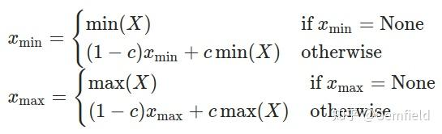

### Post Training Dynamic Quantization on Eager Mode Quantization

Eager Mode Quantization模式下的训练后动态量化，这是最简单的量化形式，即权重提前量化(静态量化)，但激活
值在推理过程中被动态量化。这适用于模型执行时间主要由从内存加载权重而不是计算矩阵乘法决定的情况。对于批量较
小的LSTM和Transformer类型的模型，是合适的一种方式。

* 权重：训练后量化
* 激活值：网络在前向推理的时候动态量化

**API**: 
> torch.quantization.quantize_dynamic(model, qconfig_spec=None, dtype=torch.qint8, mapping=None, inplace=False)

quantize_dynamic这个API把一个float model转换为dynamic quantized model，也就是只有权重被量化的model，
dtype参数可以取值float16或者qint8。当对整个模型进行转换时，默认支队一下的op进行转换：  

* Linear
* LSTM
* LSTMCell
* RNNCell
* GRUCell

因为dynamic quantized只是把权重参数进行量化，而这些layer一般参数数量很大，在整个模型中参数量占比极高，对其他
layer进行dynamic quantized几乎没有实际的意义。

**API的第二个参数：qconfig_spec**

* qconfig_spec指定了一组qconfig，具体就是哪个op对应哪个qconfig
* 每个qconfig时QConfig类的实例，封装了两个observer
* 这两个observer分别时activation的observer和weight的observer
* 但是动态量化使用的是QConfig子类QConfigDynamic的实例，该实例实际上只封装了weight的observer
* activate就是post process， 就是op forward之后的后处理，但是动态量化中不包含
* observer用来根据四元祖(min_val, max_val, qmin, qmax)来计算两个量化的参数：scale和zero_point
* qmin、qmax是算法提权确定好的，min_val和max_val是从输入数据观察到的，所以起名observer

当qconfig_spec为None的时候就是默认行为，如果想要改变默认行为，则可以：

* qconfig_spec赋值为一个set，比如：{nn.LSTM, nn.Linear}，意思是指定当前模型中的哪些layer要被
dynamic quantization；
* qconfig_spec赋值为一个dict，key为submodule的name或type，value为QConfigDynamic实例
（其包含了特定的Observer，比如MinMaxObserver、MovingAverageMinMaxObserver、PerChannelMinMaxObserver、
MovingAveragePerChannelMinMaxObserver、HistogramObserver）

调用**torch.quantization.quantize_dynamic**之后，会检索模型中op的type，如果某个op的type属于字典
DEFAULT_DYNAMIC_QUANT_MODULE_MAPPINGS的key，那么，这个op将被替换为key对应的value：
```
# Default map for swapping dynamic modules
DEFAULT_DYNAMIC_QUANT_MODULE_MAPPINGS = {
    nn.GRUCell: nnqd.GRUCell,
    nn.Linear: nnqd.Linear,
    nn.LSTM: nnqd.LSTM,
    nn.LSTMCell: nnqd.LSTMCell,
    nn.RNNCell: nnqd.RNNCell,
}
```

这里，nnqd.Linear就是DynamicQuantizedLinear就是torch.nn.quantized.dynamic.modules.linear.Linear。 但是，
type从key换为value，那这个新的type如何实例化呢？更重要的是，实例化新的type一定是要用之前的权重参数的呀。没错，以
Linear为例，该逻辑定义在 nnqd.Linear的from_float()方法中，通过如下方式实例化：

```new_mod = mapping[type(mod)].from_float(mod)```

from_float做的事情主要就是：

* 使用MinMaxObserver计算模型中op权重参数中tensor的最大值最小值（这个例子中只有Linear op），缩小量化时原始值的取值
范围，提高量化的精度； 
* 通过上述步骤中得到四元组中的min_val和max_val，再结合算法确定的qmin, qmax计算出scale和zp，参考前文“Tensor的量化”
小节，计算得到量化后的weight，这个量化过程有torch.quantize_per_tensor和torch.quantize_per_channel两种，默认是
前者（因为qchema默认是torch.per_tensor_affine）； 
* 实例化nnqd.Linear，然后使用qlinear.set_weight_bias将量化后的weight和原始的bias设置到新的layer上。其中最后一步
还涉及到weight和bias的打包

**量化变量：scale和zp，是由其observer计算得到的**
在各种observer中，计算权重的scale和zp离不开四个变量：min_val,max_val,qmin,qmax，分别表示op权重数据/input tensor
分布的最小值和最大值，以及量化后的取值范围的最小值和最大值。qmin和qmax的值好确定，基本就是8个bit能表示的范围，一般取-128
和127.然后根据Observer的算法，计算得到scale和zp.

动态量化，权重的部分量化是静态的，是提前转换完毕的，而之所以叫做“动态”量化，就在于前向推理的时候动态的把input的float tensor
转换为量化tensor.

在forward的时候，nnqd.Linear会调用torch.ops.quantized.linear_dynamic函数，输入正是上面（pack好后的）量化后的
权重和float的bias，而torch.ops.quantized.linear_dynamic函数最终会被PyTorch分发到C++中的apply_dynamic_impl函数，
在这里，或者使用FBGEMM的实现（x86-64设备），或者使用QNNPACK的实现（ARM设备上）

也就是说，动态量化的本质就是：基于运行时对数据范围的观察，来动态确定对输入进行量化时的scale值，这就确保input tensor的scale
因子能够基于输入数据进行优化，从而获得颗粒度更细的信息。

而模型的参数(weight)则时提前就转换为int8的格式(在使用quantize_dynamic api的时候)。这样，当输入也被量化后，网络中的
运算就是使用向量化的int8指令来完成的。而在当前layer输出的时候，我们还需要把结果重新转换为float32----re-quantization
的scale值时一句input、weight和output scale来确定的，定义如下：
> requant_scale = input_scale_fp32 * weight_scale_fp32 / out_scale_fp32

动态量化模型的前向推理过程可以理解为：
```
#原始的模型，所有的tensor和计算都是浮点型
previous_layer_fp32 -- linear_fp32 -- activation_fp32 -- next_layer_fp32
                 /
linear_weight_fp32

#动态量化后的模型，Linear和LSTM的权重是int8
previous_layer_fp32 -- linear_int8_w_fp32_inp -- activation_fp32 -- next_layer_fp32
                     /
   linear_weight_int8
```

总体来说，动态量化，或者叫做weight-only的量化，是提前把模型中某些op的参数(weight)转换为int8，然后在运行的时候动态
的把输入量转换为int8，然后在当前op输出的时候再把结果requantization转回float32类型。动态量化默认值只适用于Linear
以及RNN的变种，但是在运行时对每一层的激活值进行校准和量化会增加计算开销。


### Post Training Static Quantization on Eager Mode Quantization 

Eager Mode Quantization模式下的训练后静态量化，权重和激活值都是静态量化，将激活融合到前面的层中，量化后
需要数据集进行校准，以确定激活的最佳量化参数。适用于内存带宽和计算节省都很重要的情况，例如：CNN.

与动态量化区别：
* 相同点就是，都是把网络的权重参数转从float32转换为int8；
* 不同点是，需要把训练集或者和训练集分布类似的数据喂给模型（注意没有反向传播），然后通过每个op输入的分布特点来
计算activation的量化参数（scale和zp）——称之为Calibrate（定标）。

PyTorch会使用五部曲来完成模型的静态量化：

1. 模块融合：fuse_modules
合并一些可以合并的layer。这一步的目的是为了提高速度和准确度：

> fuse_modules(model, modules_to_fuse, inplace=False, fuser_func=fuse_known_modules, fuse_custom_config_dict=None)

比如给fuse_modules传递下面的参数就会合并网络中的conv1、bn1、relu1：
>torch.quantization.fuse_modules(gemfield_model, [['conv1', 'bn1', 'relu1']], inplace=True)

一旦合并成功，那么原始网络中的conv1就会被替换为新的合并后的module（因为其是list中的第一个元素），而bn1、relu1
（list中剩余的元素）会被替换为nn.Identity()，这个模块是个占位符，直接输出输入。

不是什么类型的op都可以参与合并，也不是什么样的顺序都可以参与合并。 
```
_DEFAULT_OP_LIST_TO_FUSER_METHOD: Dict[Tuple, Union[nn.Sequential, Callable]] = {
    (nn.Conv1d, nn.BatchNorm1d): fuse_conv_bn,
    (nn.Conv1d, nn.BatchNorm1d, nn.ReLU): fuse_conv_bn_relu,
    (nn.Conv2d, nn.BatchNorm2d): fuse_conv_bn,
    (nn.Conv2d, nn.BatchNorm2d, nn.ReLU): fuse_conv_bn_relu,
    (nn.Conv3d, nn.BatchNorm3d): fuse_conv_bn,
    (nn.Conv3d, nn.BatchNorm3d, nn.ReLU): fuse_conv_bn_relu,
    (nn.Conv1d, nn.ReLU): _sequential_wrapper2(nni.ConvReLU1d),
    (nn.Conv2d, nn.ReLU): _sequential_wrapper2(nni.ConvReLU2d),
    (nn.Conv3d, nn.ReLU): _sequential_wrapper2(nni.ConvReLU3d),
    (nn.Linear, nn.BatchNorm1d): fuse_linear_bn,
    (nn.Linear, nn.ReLU): _sequential_wrapper2(nni.LinearReLU),
    (nn.BatchNorm2d, nn.ReLU): _sequential_wrapper2(nni.BNReLU2d),
    (nn.BatchNorm3d, nn.ReLU): _sequential_wrapper2(nni.BNReLU3d),
    (nn.ConvTranspose1d, nn.BatchNorm1d): fuse_convtranspose_bn,
    (nn.ConvTranspose2d, nn.BatchNorm2d): fuse_convtranspose_bn,
    (nn.ConvTranspose3d, nn.BatchNorm3d): fuse_convtranspose_bn,
}
```
2. 设置量化配置 qconfig
qconfig是要设置到模型或者模型的子module上的。qconfig是QConfig的一个实例，QConfig这个类就是维护了两个
observer，一个是activation所使用的observer，一个是op权重所使用的observer。

```
# 设置config
net.qconfig = torch.quantization.get_default_qconfig('后端名称')
```

目前支持的后端及默认的Observer方法：

| 量化的backend |                   activation                    |                      weight                       |
|:----------:|:-----------------------------------------------:|:-------------------------------------------------:|
|   fbgemm   | HistogramObserver.with_args(reduce_range=True)  |  PerChannelMinMaxObserver(per_channel_symmetric)  |
|  qnnpack   | HistogramObserver.with_args(reduce_range=False) |       MinMaxObserver(per_tensor_symmetric)        |
|   onednn   | HistogramObserver.with_args(reduce_range=False) |  PerChannelMinMaxObserver(per_channel_symmetric)  |
|    x86     | HistogramObserver.with_args(reduce_range=True)  |  PerChannelMinMaxObserver(per_channel_symmetric)  |

3. 准备量化模型，插入观测Observer：torch.quantization.prepare，用来手机和定标数据。
prepare调用是通过如下API完成的：

```
net_prepared = torch.quantization.prepare(net)
```

prepare用来给每个子module插入Observer，用来收集和标定数据。以activate的observer为例，就是期望其观察
插入数据得到四元组中的min_val和max_val，至少观察个几百个迭代的数据，然后由这四元组得到scale和zp这两个
参数的值。

具体实现，将Observer方法注册前向传播钩子，register_forward_hook，当前向计算完成后，结果会被立刻送到其
hooks中的HistogramObserver进行观察。

4. 喂数据，即模型校准
这一步不是训练。是为了获取数据的分布特点，来更好的计算activation的scale和zp。至少要喂上几百个迭代的数据，。

5. 转换模型
第四步完成后，各个op权重的四元组（min_val，max_val，qmin, qmax）中的min_val，max_val已经有了，各个
op activation的四元组（min_val，max_val，qmin, qmax）中的min_val，max_val也已经观察出来了。那么
在这一步我们将调用convert API：
```
net_prepared_int8 = torch.quantization.convert(net)
```
这个过程和dynamic量化类似，本质就是检索模型中op的type，如果某个op的type属于字典DEFAULT_STATIC_QUANT_MODULE_MAPPINGS
的key（注意字典和动态量化的不一样了），那么，这个op将被替换为key对应的value：

替换的过程也和dynamic一样，使用from_float() API，这个API会使用前面的四元组信息计算出op权重和
op activation的scale和zp，然后用于量化。

**量化所有的参数：scale和zp都分为两个步骤算出来的：**
```
QConfig(activation=HistogramObserver.with_args(reduce_range=True),
        weight=PerChannelMinMaxObserver.with_args(
    dtype=torch.qint8, qscheme=torch.per_channel_symmetric
))
```
1. 确定四元组(val_max, val_min, q_max, qmin)
val_max和val_min：是根据Observer算法算出来的，如：MaxMin、Histogram、KL散度等
q_max和q_min：根据量化类型dtype算出来的
2. 计算scale和zp
根据量化类型dtype和量化方案qscheme，计算得出的
qint8: 对称量化
quint8: 非对称量化

目前支持的量化方案：
* torch.per_tensor_affine 
* torch.per_tensor_symmetric 
* torch.per_channel_affine 
* torch.per_channel_symmetric
* per_channel_affine_float_qparams

目前支持的量化类型：
* torch.quint8 
* torch.qint8 
* torch.qint32
* quint4x2 
* quint2x4

**静态量化模型如何推理：**

在PyTorch的网络中，前向推理逻辑都是实现在了每个op的forward函数中。而完成convert后，所有的op被替换
成了量化版本的op，在静态量化中，权重和激活都是提前计算好的。

在量化的模型结构中，需要实例化量化(torch.ao.quantization.QuantStub())和
反量化类(torch.ao.quantization.DeQuantStub())，并在网络forward函数中开始和结束位置插入stub.

QuantStub在observer阶段会记录参数值，DeQuantStub在prepare阶段相当于Identity；而在convert API
调用过程中，会分别被替换为nnq.Quantize和nnq.DeQuantize。并且调用from_float()API，这个API会使用
前面的四元组信息计算出op权重和op activation的scale和zp，然后用于量化。

而具体量化的实现就在替换后nnq.Quantize和nnq.DeQuantize中的forward函数中：
```
class Quantize(torch.nn.Module):
    """
    """ 
    def forward(self, X):
       return torch.quantize_per_tensor(X, float(self.scale),
                                         int(self.zero_point), self.dtype)
```

静态量化模型的前向推理过程可以理解为：
```
#原始的模型，所有的tensor和计算都是浮点型
previous_layer_fp32 -- linear_fp32 -- activation_fp32 -- next_layer_fp32
                    /
    linear_weight_fp32

#静态量化的模型，权重和输入都是int8
previous_layer_int8 -- linear_with_activation_int8 -- next_layer_int8
                    /
  linear_weight_int8
```

最后再说一下**动态量化和静态量化的最大区别：**

* 静态量化的float输入必须经过QuantStub变为int，直到调用DeQuantStub前都是int
* 动态量化的float输入是经过动态计算的scale和zp量化为int，op输出时转换回float


### Quantization Aware Training on Eager Mode Quantization 

Eager Mode Quantization模式下的训练中量化，前面两种量化方法都有一个post关键字，意思是模型
训练完毕后所做的量化。而QAT则不一样，是指在训练过程中就开启了量化功能。

QAT也需要五部曲：

1. 设置config

在设置qconfig之前，模型首先设置为训练模式。
```
net.eval()
```

使用get_default_qat_qconfig API来给要QAT的网络设置qconfig：
```
net.config = torch.quantization.get_default_qat_qconfig('后端名称')
```
不过，这个qconfig和静态量化中的可不一样啊。前文说过qconfig维护了两个observer，activation
的和权重的。QAT的qconfig中，activation和权重的observer都变成了FakeQuantize
（和observer是has a的关系，即包含一个observer），并且参数不一样
（qmin、qmax、schema,dtype,qschema,reduce_range这些参数），**不同的后端默认的config不同**，
qnnpack的默认config如下所示：
```
# qnnpack
#activation的observer的参数
FusedMovingAvgObsFakeQuantize.with_args(observer=MovingAverageMinMaxObserver,
                                                                 quant_min=0,
                                                                 quant_max=255,
                                                                 reduce_range=False)
#权重的observer的参数
FusedMovingAvgObsFakeQuantize.with_args(observer=MovingAverageMinMaxObserver,
                                                                      quant_min=-128,
                                                                      quant_max=127,
                                                                      dtype=torch.qint8,
                                                                      qscheme=torch.per_tensor_symmetric)
```
这里FakeQuantize包含的observer是MovingAverageMinMaxObserver，继承自前面提到过的MinMaxObserver，
但是求最小值和最大值的方法有点区别，使用的是如下公式：


* Xmin、Xmax是当前运行中正在求解和最终求解的最小值、最大值
* X是当前输入的tensor
* c是一个常数，PyTorch中默认为0.01，也就是最新一次的极值由上一次贡献99%，当前的tensor贡献1%

MovingAverageMinMaxObserver在求min、max的方式和其基类MinMaxObserver有所区别之外，scale和
zero_points的计算则是一致的。

2. 融合模型 fuse_modules
和静态量化一样。

3. 准备量化模型(和训练后量化不同):插入观测
在静态量化中，我们这一步使用的是prepare API，而在QAT这里使用的是prepare_qat API。最重要的区别
有两点：

* prepare_qat要把qconfig安插到每个op上，qconfig的内容本身就不同，参考五部曲中的第一步；
* prepare_qat 中需要多做一步转换子module的工作，需要inplace的把模型中的一些子module替换了，
替换的逻辑就是从DEFAULT_QAT_MODULE_MAPPINGS的key替换为value，这个字典的定义如下：
```
# Default map for swapping float module to qat modules
DEFAULT_QAT_MODULE_MAPPINGS : Dict[Callable, Any] = {
    nn.Conv2d: nnqat.Conv2d,
    nn.Conv3d: nnqat.Conv3d,
    nn.Linear: nnqat.Linear,
    nn.modules.linear.NonDynamicallyQuantizableLinear: nnqat.Linear,
    # Intrinsic modules:
    nni.ConvBn1d: nniqat.ConvBn1d,
    nni.ConvBn2d: nniqat.ConvBn2d,
    nni.ConvBn3d: nniqat.ConvBn3d,
    nni.ConvBnReLU1d: nniqat.ConvBnReLU1d,
    nni.ConvBnReLU2d: nniqat.ConvBnReLU2d,
    nni.ConvBnReLU3d: nniqat.ConvBnReLU3d,
    nni.ConvReLU2d: nniqat.ConvReLU2d,
    nni.ConvReLU3d: nniqat.ConvReLU3d,
    nni.LinearReLU: nniqat.LinearReLU,
    nni.LinearBn1d: nniqat.LinearBn1d,
}
```

4. 喂数据
和静态量化完全不同，在QAT中这一步是用来训练的。我们知道，在PyTorch的网络中，前向推理逻辑都是
实现在了每个op的forward函数中。而在prepare_qat中，所有的op被替换成了QAT版本的op.

Conv2d被替换为了QATConv2d：
```
def forward(self, input):
   return self.activation_post_process(self._conv_forward(input, self.weight_fake_quant(self.weight)))
```

Linear被替换为了QATLinear:
```
def forward(self, input):
    return self.activation_post_process(F.linear(input, self.weight_fake_quant(self.weight), self.bias))
```

ReLU还是那个ReLU，可以看出来，每个op的输入都需要经过self.weight_fake_quant来处理下，输出又都
需要经过self.activation_post_process来处理下，这两个都是FakeQuantize的实例，只是里面包含的
observer不一样。

```
# conv2d
weight=functools.partial(<class 'torch.ao.quantization.fake_quantize.FusedMovingAvgObsFakeQuantize'>, 
                                    observer=<class 'torch.ao.quantization.observer.MovingAverageMinMaxObserver'>, 
                                    quant_min=-128, 
                                    quant_max=127, 
                                    dtype=torch.qint8, 
                                    qscheme=torch.per_tensor_symmetric)

acvivation=functools.partial(<class 'torch.ao.quantization.fake_quantize.FusedMovingAvgObsFakeQuantize'>, 
                                        observer=<class 'torch.ao.quantization.observer.MovingAverageMinMaxObserver'>, 
                                        quant_min=0, 
                                        quant_max=255, 
                                        reduce_range=False)
```

而FakeQuantize的forward函数如下所示：
```
def forward(self, X):
        if self.observer_enabled[0] == 1:
            #使用移动平均算法计算scale和zp

        if self.fake_quant_enabled[0] == 1:
            if self.is_per_channel:
                X = torch.fake_quantize_per_channel_affine(...)
            else:
                X = torch.fake_quantize_per_tensor_affine(...)
        return X
```

FakeQuantize中的fake_quantize_per_channel_affine和fake_quantize_per_tensor_affine
实现了quantize和dequantize，用公式表示的话为：

> out = (clamp(round(x/scale + zero_point), quant_min, quant_max)-zero_point)*scale

也就是说，这是把量化的误差引入到了训练loss之中呀！

这样，在QAT中，所有的weights和activations就像上面那样被fake quantized了，且参与模型训练中的前向和反向计算。
float值被round成了（用来模拟的）int8值，但是所有的计算仍然是通过float来完成的。 这样以来，所有的权重在优化过程
中都能感知到量化带来的影响，称之为量化感知训练（支持cpu和cuda），精度也因此更高。

5. 转换模型

这一步和静态量化一样，需要注意的是，QAT中，有一些module在prepare中已经转换成新的module了，所以静态量化中所使
用的字典包含有如下的条目：

```
DEFAULT_STATIC_QUANT_MODULE_MAPPINGS = {
    ......
    # QAT modules:
    nnqat.Linear: nnq.Linear,
    nnqat.Conv2d: nnq.Conv2d,
    nnqat.Conv3d: nnq.Conv3d,
} 
```

总结下来就是：

```
# 原始的模型，所有的tensor和计算都是浮点
previous_layer_fp32 -- linear_fp32 -- activation_fp32 -- next_layer_fp32
                      /
    linear_weight_fp32

# 训练过程中，fake_quants发挥作用
previous_layer_fp32 -- fq -- linear_fp32 -- activation_fp32 -- fq -- next_layer_fp32
                           /
   linear_weight_fp32 -- fq

# 量化后的模型进行推理，权重和输入都是int8
previous_layer_int8 -- linear_with_activation_int8 -- next_layer_int8
                     /
   linear_weight_int8
```


