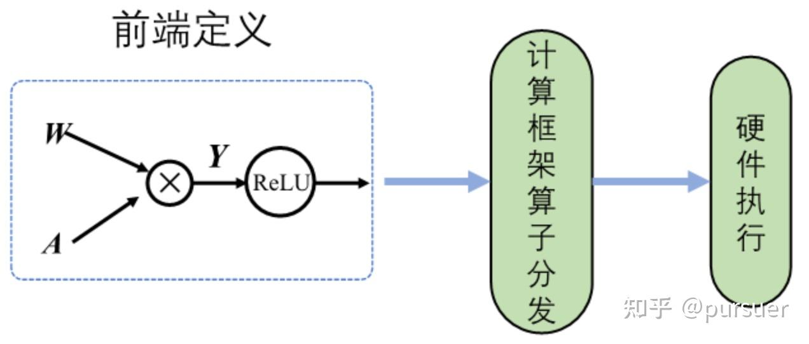
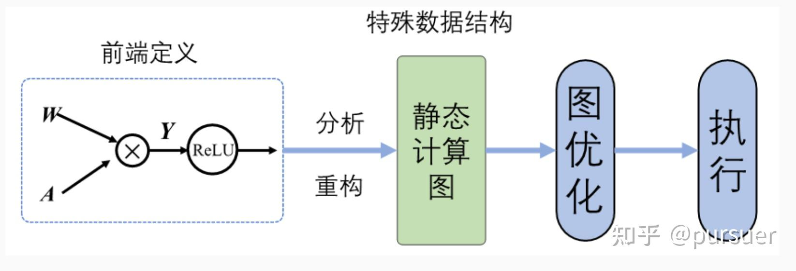

### torch.fx

PyTorch这种基于动态图执行模型的深度学习框架虽然提升了用户的易用性，但是图结构不能被提前感知和变换，而在一些真实场景中，
用户可能需要捕获和变换程序结构(也可以理解为神经网络的结构)来进行性能调优、可视化、分析和硬件调优等。为了解决这个痛点，
PyTorch设计了torch.fx这个模块来做PyTorch程序的捕获和变换。

论文地址：https://arxiv.org/pdf/2112.08429.pdf

#### 动态图和静态图框架

##### 概念

目前神经网络架构分为静态图架构和动态图架构，目前最为流行的PyTorch 和 TensorFlow框架，其最大的区别就是他们拥有不同
的计算图表现形式。 早先的TensorFlow 使用静态图（在运行时整个网络的拓扑图结构已经明晰）。而在 PyTorch 中，每次都会
重新构建一个新的计算图（计算图是运行时生成的）。对于使用者来说，两种形式的计算图有着非常大的区别。

#### 优缺点：

* 动态图：比较方便debug，非常容易上手，但是优化部署较为不易
* 静态图：通过先定义运行的方式，之后再次运行的时候就不再需要重新构建计算图，所以速度更快。同时，由于全局的计算图结构
在开始的时候已经定义好了，对于模型优化和部署更加友好，但是对于初学者而言学习和使用起来不是很友好。

#### 执行过程差异

动态图：

静态图：

#### 代码差异
while 循环语句在 TensorFlow 和 PyTorch 中的定义的差异

**TensorFlow：**  
需要将整个图构建成静态的，换句话说，每次运行的时候图都是一样的，是不能够改变的，所以不能直接使用 Python 
的 while 循环语句，需要使用辅助函数 tf.while_loop 写成 TensorFlow 内部的形式,这是非常反直觉的，
学习成本也是比较高的.

**PyTorch：** 
pytorch能够使用 Python 的 while 写循环，没有任何额外的学习成本。

#### 动态图和静态图之间的转换

动态图便于调试，适用于模型构建实验阶段。静态图执行高效，节省模型训练时间，可以让机器学习框架结合两种模式的优势呢？
事实上，目前TensorFlow、MindSpore、PyTorch、PaddlePaddle等主流机器学习框架为了兼顾动态图易用性和静态图执行
性能高效两方面优势，均具备动态图转静态图的功能，支持使用动态图编写代码，框架自动转换为静态图网络结构执行计算。

|      框架      |                                                                动态图转静态图                                                                |      
|:------------:|:-------------------------------------------------------------------------------------------------------------------------------------:|
|  TensorFlow  |                                          @tf_function追踪算子调度构建动态图，其中AutoGraph机制可以自动转换控制流为静态表达                                          |  
|  MindSpore   | context.set_context(mode=context.PYNATIVE_MODE)动态图模式  context.set_context(mode=context.GRAPH_MODE)动态图模式， @ms_function支持基于源码转换 | 
|   PyTorch    |                                               torch.fx.symbolic_trace()(符号追踪)：提取模型内部结构                                                |  
| PaddlePaddle |                                 paddle.jit.to_static()支持基于源码转换，paddle.jit.TracedLayertrace()支持基于追踪转换                                  |  

####  动态图转换为静态图的实现方式

* 基于追踪转换：以动态图模式执行并记录调度的算子，构建和保存为静态图模型。
**注意**：追踪技术**只是记录第一次执行动态图时调度的算子**，但若是模型中存在依赖于中间结果的条件分支控制流，只能追踪到根据
第一次执行时触发的分支。此时构建的静态图模型并不是完整的，缺失了数据未流向的其他分支。在后续的调用中，因为静态模型
已无法再改变，若计算过程中数据流向缺失分支会导致模型运行错误。同样的，依赖于中间数据结果的循环控制也无法追踪到全部
的迭代状态。

* 基于源码转换：弥补了前者的缺点，分析前端代码来将动态图代码自动转写为静态图代码，并在底层自动帮助用户使用静态图
执行器运行。

#### 对于量化来说：
* 出现前：Eager Mode Quantization 需要手工修改网络代码，并对很多节点进行替换，不符合设计原则，代码耦合
性非常高
* 出现后：而 FX Graph Mode Quantization 则大大提高了自动化的能力。torch.fx这个工具包的主要功能是实现对
nn.Module实例的变换，在原模型基础上进行功能增强，代码解耦。

#### torch.fx优点：
1. 对深度学习程序很重要的程序捕获和转换的实用分析特性。Trace
2. 一个仅用Python实现的程序捕获库，可以进行定制以捕获不同级别的程序细节。  Pure Python
3. 一个简单的只有 6 条指令的 IR，用于表示捕获的程序，重点是易于理解和易于进行静态分析。 IR
4. 用于将变换后的代码返回到宿主语言生态系统的代码生成系统。Codegen
5. 关于如何在实践中使用 torch.fx 开发性能优化、程序分析、设备lowering等功能的案例研究。 Eager Pass

#### 对比Eager模式：
1. Eager模式量化需要在原网络节点中插入一些伪量化节点，或者把一些Module或者Function替换成量化的形式，而torch.fx
不需要。
2. Eager模式，由于它只会对 init 函数里面定义的模块进行替换，因此，如果有一些 op 没有在 init 中定义，但
又在 forward 中用到了（比如上面代码的F.relu），那就会出错。而torch.fx会自动跟踪 forward 里面的代码。
3. Eager模式需要手动融合才能量化，而torch.fx会自动融合。
4. torch.fx可以自由的修改和变换op.

#### 与TorchScript的区别
* FX更侧重于对模型进行一些功能性的改变（比如批量增加、修改某个操作，比如增加统计操作，比如量化）；
* TorchScript更侧重于优化当前模型的性能，并且可以脱离python，仅在C++环境运行。

FX仅仅是做Python2Python的转换，不像TorchScript一样是为了做部署(脱离Python这个环境，在C++中运行)而做转换。
两者没什么关系，不冲突，用FX转换后的模型也可以用TorchScript继续转换，两者是正交的。

