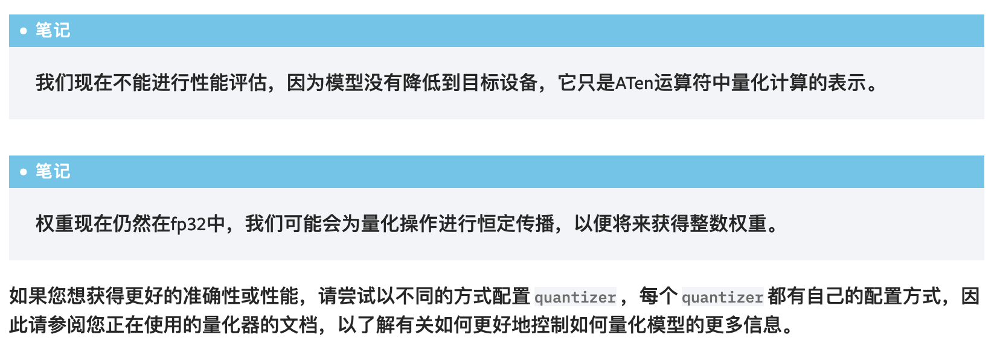

### pytorch 2

PyTorch 2导出量化是新的全图形模式量化工作流程，在PyTorch 2.1中作为原型功能发布。有了PyTorch 2，我们正在
转向更好的完整程序捕获解决方案（torch.export），因为它可以捕获更高的模型百分比（14K模型为88.8%）与
torch.fx.symbolic_trace（14K模型为72.7%），FX图形模式量化使用的程序捕获解决方案。**torch.export在一些
python结构方面仍然有局限性，需要用户参与以支持导出模型的动态**，但总体而言，它比之前的程序捕获解决方案有所改进。
PyTorch 2 Export Quantization是为torch.export捕获的模型构建的，同时考虑到建模用户和后端开发人员的灵活性和
生产力。

**注意**：本教程描述了一个原型功能。原型功能通常不作为PyPI或Conda等二进制发行版的一部分提供，除了有时在运行时标志后面，
并且处于反馈和测试的早期阶段。问题比较多。

#### 主要特点是
1. 可编程API用于配置模型的量化方式，可以扩展到更多用例。
2. 简化了UX，用于建模用户和后端开发人员，因为他们只需要与单个对象（Quantizer）交互，以表达用户对如何量化模型以
及后端支持的意图。
3. 可选的参考量化模型表示，可以通过整数运算表示量化计算，该整数操作更接近硬件中发生的实际量化计算。

#### 架构图
```
float_model(Python)                          Example Input
    \                                              /
     \                                            /
—-------------------------------------------------------
|                        export                        |
—-------------------------------------------------------
                            |
                    FX Graph in ATen     Backend Specific Quantizer
                            |                       /
—--------------------------------------------------------
|                     prepare_pt2e                      |
—--------------------------------------------------------
                            |
                     Calibrate/Train
                            |
—--------------------------------------------------------
|                    convert_pt2e                       |
—--------------------------------------------------------
                            |
                    Quantized Model
                            |
—--------------------------------------------------------
|                       Lowering                        |
—--------------------------------------------------------
                            |
        Executorch, Inductor or <Other Backends>

```

#### 问题
1. 目前不能降低性能：  
此时产生的模型不是在设备上运行的最终模型，它是一个参考量化模型，从用户那里捕获预期的量化计算，表示为ATen运算符和一些
额外的量化/去量化运算符，为了获得在真实设备上运行的模型，我们需要降低模型。例如，对于在边缘设备上运行的模型，我们可以
降低委托和ExecuTorch运行时运算符。

2. 一些默认的配置尚未明确。
3. 一些API，可能会改。

#### 未来
PyTorch 2导出量化提供了更好的捕获程序的能力，这点弥补了torch.fx的不足(如forward中的判断语句等，捕获不了)，
且可以自定义量化器的功能，可以更好的量化更多的op，提高了灵活性。

当然，目前来看，功能还处于初期阶段，期待后续进展！
