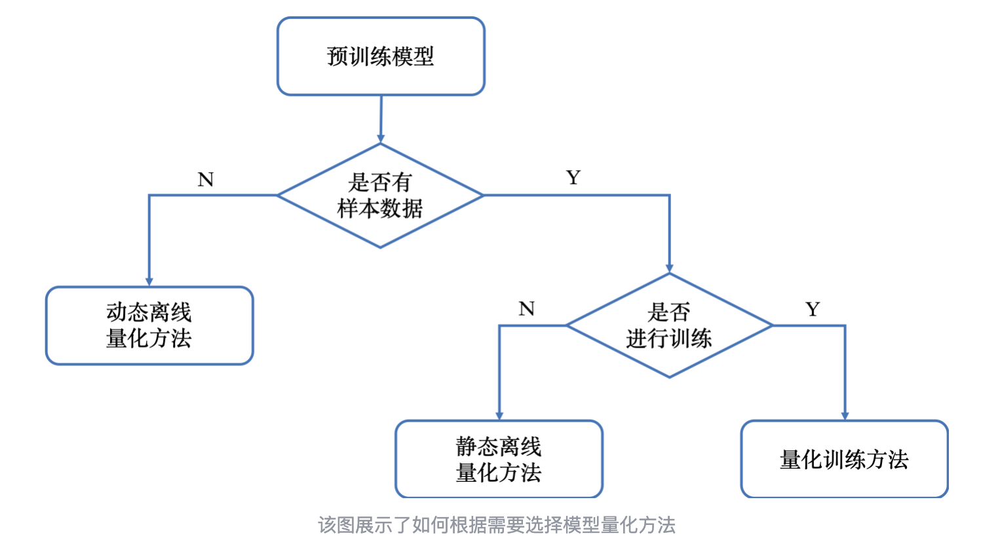
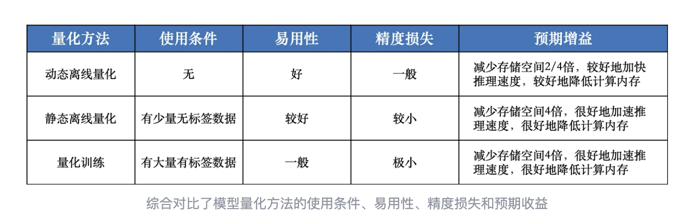
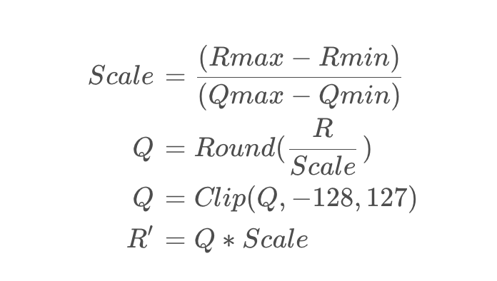
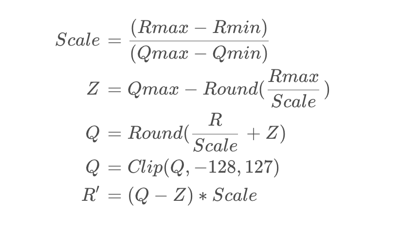
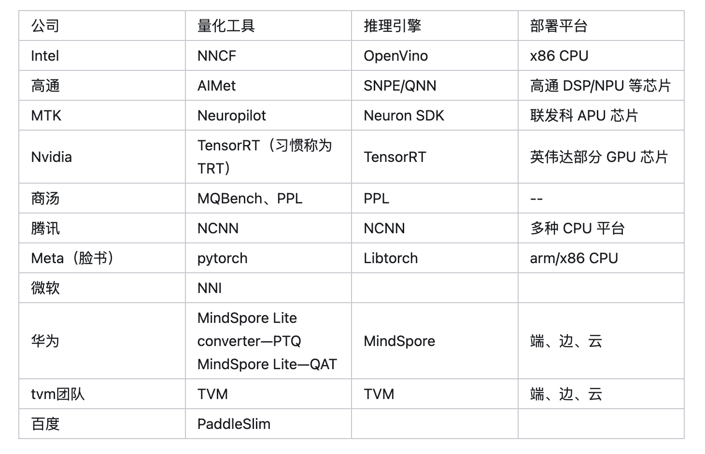

## 总结
### 1.量化分类
根据谷歌量化白皮书中定义，量化分为训练后量化(Post-Training Quantization, PTQ)和量化感知训练
(Quant Aware Training, QAT), 而PTQ又包括两种量化方式，即PTQ Dynamic, PTQ Static。

#### 1.1 量化感知训练(Quant Aware Training, QAT)：
量化训练让模型感知量化运算对莫模型精度带来的影响，通过finetune训练降低量化误差。这种方法会降低训练速度，
但是能够获得更高的精度。

#### 1.2 动态离线量化(Post Training Quantization Dynamic, PTQ Dynamic)：
动态离线量化仅将模型中特定算子的权重从FP32类型映射成INT8/16类型，bias和激活函数在推理过程中动态量化。
但是对于不同的输入值来说，其缩放因子也是**动态计算**的。动态量化是几种量化方法中性能最差的，且不一定是
精度最高的。  

动态量化常用于非常大的模型。

#### 1.3 静态离线量化 (Post Training Quantization Static, PTQ Static)：
静态离线量化使用少量无标签校准数据，采用KL散度等方法计算量化比例因子(scale)。静态量化与动态量化的区别
在于其输入的缩放因子计算方法不同，静态量化的模型在使用前有“calibrate”的过程(校准缩放因子)：准备部分
输入(对于图像分类模型就是准备一些图片，其他任务类似)，使用静态量化后的模型进行预测，在此过程中量化模型
的缩放因子会根据输入数据的分布进行调整。一旦校准完成后，权重和输入的缩放因子都固定。静态量化的性能一般
比动态量化好。  

静态量化常用于中等模型和大模型。

静态离线量化的目标是求取量化比例因子，主要通过对称量化、非对称量化方式来求得，而找到最大值或者阀值的方法
有MinMax、KLD、ADMM、EQ等方法。  

#### 其他
1. 静态PTQ 为什么需要校准，校准的数据是哪些？
A: 对于一个模型，训练完成之后，权重是固定且保存了下来，但是激活值，即每个层网络的输入和输出是不固定的，
且没有办法获取，只有通过模型的前向传播才能得到。而校准的过程就是统计每一层网络输入和输出的数值范围，进
而对其进行量化，即激活量化。
2. PTQ目前用的比较多，QAT用的比较少。
3. 3种量化方式区分：

4. 3种量化方式对比：

### 2.量化方法
量化方法：非对称量化、对称量化、随机量化

#### 2.1 非对称量化

**注意**：对于单边分布如(2.5, 3.5)，需要将其范围放宽至(0, 3.5)再量化，否则在极端单边分布情况下会损
失精度。  
即**若min大于0，就将范围缩放到(0, max)再执行量化**

#### 2.2 对称量化

#### 2.3 随机量化
随机量化与非对称量化类似，区别在于量化时引入了噪声z，其参数计算与反量化过程与非对称量化相同。

#### 2.4 其他
在硬件支持的情况下，**量化时对激活值X使用非对称量化，对权重值W使用对称量化**，这是一种常用的量化方案。
(谷歌白皮书建议)

### 3.量化工具/框架

当然，还有其他厂家的未开源的工具，如芯原、寒武纪、地平线这些厂家都有自己的量化工具。

看了上面的这种表后，会发现：不同量化训练工具能部署的推理框架和平台是不一样的。这就意味着，如果要把量化的
模型部署到英伟达的GPU平台，就得用英伟达的TRT进行量化训练然后导出模型，进行部署。

同样地，如果要用 华为的 NPU 来部署，就得用 MindSpore。

但是有一点，各家量化工具基本都遵循谷歌量化白皮书，因此大体上量化算法是类似的。

### 4.量化策略
**TensorRT量化思路(PTQ static)**：使用校准数据集，使得KL散度为最小值来直到量化时的激活层阀值，来量化
激活值。权重量化时使用的abs(值)的最大值作为阀值量化的。  

即权重量化用Max方法，激活量化用的KL散度方法  

**TensorflowLite量化思路**：权重和激活量化都使用Max方法。

常用几种量化策略：MinMax、KLD、ADMM、EQ。

EQ 量化⽅法的主要思想是：误差累计、整⽹决策变成单⽹决策、以余弦相似度为优化⽬标、交替优化权重缩放系数和
激活值缩放系数。

总结就是上面说到的权重量化和激活量化时候的scale和bias怎么选择；**通常是权重的参数直接计算出来，而激活层更
需要量化策略寻找最佳参数；**

#### 4.1 TensorRT
TensorRT的量化工具也比较成熟了。具体流程就是，导出ONNX模型，转换为TensorRT的过程中可以使用TRT提供的
Calibration方法去校准，这个使用起来比较简单。可以直接使用trt官方提供的trtexec命令去实现，也可以使用trt
提供的python或者C++的API接口去量化。

**TensorRT实现int8量化**
* 对权重直接使用最大值量化(非饱和量化)
* 对偏移直接忽略
* 对激活值采用饱和量化(KL散度)

a）非饱和量化方法（No Saturation）：map |max| to 127

非饱和量化方法计算 FP32 类型 Tensor 中绝对值的最大值 abs_max，将其映射为 127，则量化比例因子等于 
abs_max/127

b）饱和量化方法（Saturation）：above |threshold| to 127

饱和量化方法使用 KL 散度计算一个合适的阈值 T（0 < T < mab_max），将其映射为 127，则量化比例因子等于
T/127

**Q: 激活为什么用饱和量化？**
A：因为激活值通常分布不均匀，直接使用非饱和量化会使得量化后的值都挤到一个很小的范围，从而浪费了INT8范围
内的其他空间，也就是没有充分利用INT8(-128~127)的值域。而进行饱和量化后，使得映射后的-128~127范围内分
布相对均匀，这相当于去掉一些不重要因素，保留了主要成分。

**INT8量化校准过程**
* 先在一个校准数据集上跑一遍原FP32的模型； 
* 然后，对每一层都收集激活值的直方图（默认2048个bin），并生成在不同阈值下的饱和量化分布； 
* 最后，找出使得KL散度最小的那个阈值T，即为所求

**TensorRT训练中量化**
此外，训练中量化(QAT)是TensorRT8新出的一个“新特性”，这个特性其实是指TensorRT有直接加载QAT模型的能力。
实际上QAT过程和TensorRT没有太大关系，trt只是一个推理框架，实际的训练中量化操作一般都是在训练框架中去做，
比如我们熟悉的Pytorch。这一点跟TVM类似，都可以导入提前量化好的模型来做后续部署。

