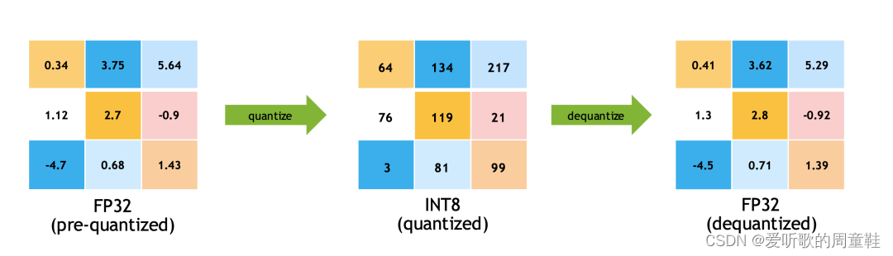

### TensorRT量化
> TensorRT有两种量化模式，分别是implicitly以及explicitly量化。前者是隐式量化，在trt7版本之前用的比较多。而后者
是显示量化，在trt8版本后才完全支持，具体就是可以加载带有QDQ信息的模型，然后生成对应量化版本的engine.

#### PTQ
PTQ(Post-Training Quantization)，即训练后量化也叫隐式量化，tensorRT的训练后量化算法第一次公布在2017年，NVIDIA
放出了使用交叉熵量化的一个PPT，简单说明了其量化原理和流程，其思想集中在tensorRT内部可供用户使用。对用于是闭源的，我们
只能通过tensorRT提供的API量化。

PTQ量化不需要训练，只需要提供一些样本图片，然后在已经训练好的模型上进行校准，统计出来需要的每一层的scale就可以实现量化，
大概流程如下：

* 在准备好的校准数据集上评估预训练模型
* 使用校准数据来校准模型(校准数据可以是训练集的子集)
* 计算网络中权重和激活的动态范围来计量化参数(q-params: scale、z)
* 使用q-params量化网络并执行推理

具体来说就是我们导出ONNX模型，转换为engine的过程中使用tensorRT提供的Calibration方法校准，这个使用起来比较简单。可以
直接使用tensorRT官方提供的trtexec工具来实现，也可以使用它提供的Python或者C++的API接口实现。

目前tensorRT提供了多种校准方法，分别适合于不同的任务

* EntropyCalibratorV2
* 适合于基于CNN的网络
* MinMaxCalibrator
* 适合于NLP任务，如BERT
* EntropyCalibrator
* 老版的 entropy calibrator
* LegacyCalibrator

通过上述这些校准算法进行PTQ量化时，tensorRT会在优化网络的时候尝试INT8精度，假设某一层在INT8精度下速度优于默认精度(FP32
或者FP16)，则有限使用INT8.

值得注意的是，**PTQ量化中我们无法控制某一层的精度**，因为tensorRT是以速度优化为优先的，很可能某一层你想让它跑INT8结果却是
FP16。当然PTQ优点是流程简单，速度快。

#### QAT
**QAT**(Quantization Aware Training)，即训练中量化也叫显示量化。它是tensorRT8的一个新特性，这个特性其实是指tensorRT
有直接加载QAT模型的能力。而QAT模型在这里是指包含QDQ操作的量化模型，而QDQ操作就是值量化和反量化操作。

实际上QAT过程和tensorRT没有太大关系，tensorRT只是一个推理框架，实际的训练中量化操作一般就是在训练框架中去做，比如我们熟悉
的Pytorch.(当然也不排除之后一些推理框架也会有训练功能，因此同样可以在推理框架中做).

tensorRT-8可以显式的加载包含有QAT量化信息的ONNX模型，实现一系列优化后，可以生成INT8的engine.

QAT量化需要插入QAT算子且需要训练进行微调，大概流程如下：

* 准备一个预训练模型
* 在模型中添加QAT算子
* 微调带有QAT算子的模型
* 将微调后模型的量化参数即q-params存储下来
* 量化模型执行推理

带 QAT 量化信息的模型中有 QuantizeLinear 和 DequantizeLinear 模块，也就是对应的 QDQ 模块，它包含了该层和该激活值的量化 
**scale**和**zero-point**。什么是 QDQ 呢？**QDQ 其实就是 Q(量化) 和 DQ(反量化)两个 op，在网络中通常作为模拟量化的op**

QDQ模块会参与训练，负责将输入的FP32张量量化为INT8，随后再进行反量化将INT8的张量再变为FP32。值得注意的是。实际网络中训练使用的
精度还是FP32，只不过这个量化算子在训练中可以学到量化和反量化的尺度信息，这样训练的时候就可以让**模型权重和量化参数更好的适应量化
过程**(scale参数也是可以学习的)，量化后的精度也相对更高一些。

QAT量化中最重要的就是FQ(Fake-Quan)量化算子，即QDQ算子，它负责将输入该算子的参数先进行量化操作然后进行反量化操作，记录其中的
scale.

QDQ实际上就是做了量化和反量化的过程，假设输入为3x3，其QDQ算子会做如下计算：

QDQ的用途主要体现在两方面：
* 第一个是可以存储量化信息，比如scale和zero_point，这些信息可以放在Q和DQ操作中
* 第二个是可以当作是显示指定那一层是量化层，我们可以默认认为包在QDQ操作中间的op都是INT8类型的op，也就是我们需要
量化的op

因此对比显式量化(explicitly)，tensorRT的隐式量化(implicitly)就没有那么直接，在tensorRT-8版本之前我们一般都
是借助tensorRT的内部量化算法去量化(闭源)，在构建engine的时候传入图像进行校准，执行的是训练后量化(PTQ)的过程。

而有了QDQ信息，tensorRT在解析模型的时候会根据QDQ的位置找到可量化的op，然后于QDQ融合(吸收尺度信息到op中)：

因为 tensorRT8 可以直接加载通过 QAT 量化后导出为 onnx 的模型，官方也提供了 Pytorch 量化配套工具，可谓是一步到位。

tensorRT 的量化性能是非常好的，可能有些模型或者 op 已经被其他库超越(比如openppl或者tvm)，不过tensorRT 胜在支持
的比较广泛，用户很多，大部分模型都有前人踩过坑，经验相对较多些，而且支持动态 shape，适用的场景也较多。

不过 tensorRT 也有缺点，就是自定义的 INT8 插件支持度不高，很多坑要踩，也就是自己添加新的 op 难度稍大一些。对于某些
层不支持或者有 bug 的情况。

