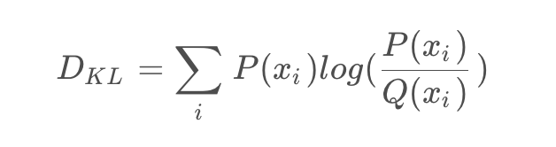

### 1. 动态范围的常用计算方法
动态范围：指的是输入数据中数值的范围
计算动态范围：是为了确定量化时使用的比特位数，即计算动态范围是为了获得更好的Scale,毕竟Scale会影响到整个量化的精度，
且Scale的计算和输入数据的值域范围有关。  

动态范围的计算方法与量化的方式相关，在对称量化中，通常采用的是：输入数据的绝对值的最大值作为动态范围的计算方法。
而非对称中，通常采用最小值和最大值的差作为动态范围的计算方法。  

常用的动态范围计算方法：
* **Max方法**：在对称量化中直接取输入数据中的绝对值的最大值作为量化的最大值。这种方法简单易用，但容易收到噪声等异常
数据的影响，导致动态范围不准确。
* **Histogram方法**：统计输入数据的直方图，根据先验知识获取某个范围内的数据，从而获得对称量化的最大值。这种方法可以
减少噪声对动态范围的影响，但需要对直方图进行统计，计算复杂度较高。
* **Entropy方法**：将输入数据的概率密度函数近似为一个高斯分布，以最小化熵作为选择动态范围的准则。这种方法也一定程度
熵较少噪声对动态范围的影响，但需要对概率魔都函数进行拟合和计算熵，计算复杂度较高。

对称量化和非对称量化的选择与动态范围的计算方法有一定的关系。对称量化要求量化的最大值和最小值的绝对值相等，可以采用Max
方法或Histogram方法进行计算。非对称量化则可以采用Entropy方法进行计算，以最小化量化后的误差。

### 2. Hisogram
#### 定义
直方图是统计学中常用的一种图形，它将数据按照数值分组并统计每组数据的出现频率，然后将频率用柱状图的方式表示出来。直方图
通常用于描述一组数据的分布情况，可以帮助人们了解数据的特征，例如数据的中心位置、离散程度、对称性、峰态等。

#### 实现
histogram方法为什么能克服Max方法中离散点即噪声干扰问题？  
主要在于直方图统计了数据出现的频率，他可以将数据按照一定的区间进行离散化处理，并计算每个区间中数据点的数量。这种方法相对于
Max来说，能够更好的反映数据的分布情况，从而更准确度评估数据的动态范围。我们假设数据服从正态分布，即离散点在两边，我们可以
通过从两边向中间靠拢的方法，去除离散点，类似于双指针的方法，算法具体流程如下：  

* 首先，统计输入数据的直方图和范围
* 然后定义左指针和右指针分别指向直方图的左边界和右边界
* 计算当前双指针之间的直方图覆盖率，如果小于等于设定的覆盖率阀值，则返回此刻的左指针指向的直方图值，如果不满足，则需要调整
双指针的值，向中间靠拢
* 如果当前左指针所指向的直方图大于右指针指向的直方图值，则右指针左移，否则左指针右移
* 循环，直到双指针覆盖的区域满足要求

**问题**  
Histogram方法虽然能够解决Max方法中的离散点噪声问题，但是使用数据直方图进行动态范围的计算，要求数据能够比较均匀的覆盖到整个
动态范围内。如果数据服从类似正态分布，则直方图的结果具有参考价值，因此此时的数据覆盖动态范围的概率较高。但如果数据分布极不均
匀或出现大量离散群，则直方图计算的结果可能并不准确，此时可考虑其他的动态范围计算方法。

### 3. Entropy
**Entropy**方法是一种基于概率分布的动态范围计算方法，通过计算概率分布之间的KL散度来选择合适的动态范围。

在量化领域中，通常所用的熵(Entropy)是指量化后的输出值的熵，即量化后的概率分布。因此，使用熵方法计算动态范围就是在计算量化后的概率分布。那么我们该如何度量量化前后的误差呢？可以使用KL散度。

在概率论或信息论中，KL散度(Kullback-Leibler divergence)又称为相对熵(relative entropy)，是描述两个概率分布P和Q差异的一种方法。

KL散度值越小，代表两种分布越相似，量化误差越小；反之，KL散度值越大，代表二种分布差异越大，量化误差越大。

#### 流程实现
利用Entropy来计算动态范围的流程如下：  
1. 统计直方图分布。首先，对于待量化的数据，统计其数值分布情况，得到数据的直方图
2. 生成p分布
3. 计算q分布
4. 归一化p和q的分布。将p和q的概率分布进行归一化，使其满足概率分布的性质
5. 计算p和q的KL散度。使用KL散度方法，计算p和q两个概率分布之间的距离，作为衡量量化误差的指标。KL散度越小
表示两个分布越相似，因此在动态范围的选择中，KL散度越小的分布更加合适。

**Entropy方法中使用了直方图和概率分布的方法来简化计算**

**疑问**：Entropy方法是怎么选取动态范围的呢？好像只是在计算KL散度来描述量化前后分布的差异🤔

对于使用Entropy方法选择动态范围，其一般流程是先统计原始数据的分布直方图，并将直方图转化为概率分布p。然后通过
计算KL散度，**寻找最优的量化分布q**，最后根据q的范围确定量化后的动态范围。

在计算KL散度时，如果q的范围时[Qmin, Qmax]，则可以通过搜索这个范围内的分布p来寻找最优的量化后分布q。具体来说
可以枚举q的分布区间内的分布概率，并计算与p pp的KL散度，最后选取KL散度最小的分布作为q qq。根据q qq的范围，则
可以得到最优的动态范围。

在量化中，动态范围通常指的是量化前的数据范围。在选择合适的量化参数(比如量化比特数)时，需要对原始数据的动态范围进
行估计，以保证量化后的数据精度尽可能地高。

在量化操作中，动态范围通常是由P和Q两个概率分布的取值范围决定的。P分布表示原始数据在浮点数表示下的取值范围，Q分布则
表示对应的量化数据的取值范围。**因此，Entropy方法计算P和Q的KL散度，是为了得到最优的Q分布，而最优的Q分布代表量化数据
的最优取值范围，量化数据的最优取值范围和原始数据的取值范围都知道了，那么最优的Scale就确定下来了。不论是非对称量化的
scale = (Rmax - Rmin) / (Qmax - Qin)，还时对称量化的scale = abs(Rmax) / Qmax**

#### 实际应用
根据P和Q的散度公式，会发现求KL散度有一个前提，就是**通过直方图统计的P和Q分布的bin要保持一致**，而实际情况又不是这样的，
比如现实情况假设P是FP32的概率分布，而Q是INT8的概率分布，由于FP32的数据量大，我们可以划分很细(如2048个bin)，而INT8的
bin数量固定，二者bin并不一致。

TensorRT的解决内方案，通过下面示例说明：  
假设我们的输入为[1,0,2,3,5,1,7]为8个bin，但Q只能用4个bin来表达，怎么操作才能让Q拥有和P一样的bin来描述呢？

1. 数据划分：按照合并后的bin将输入划分为4份，即[1,0],[2,3],[5,3],[1,7]
2. 对划分的数据求和：sum = [1],[5],[8],[8]
3. 统计划分的数据的非0个数：count = [1],[2],[2],[2]
4. 求平均： avg = sum / count = [1],[2.5],[4],[4]
5. 反映射：非零区域用对应的均值区域填充，即[1,0],[1,1],[1,1],[1,1] * [1],[2.5],[4],[4] = [1,0,2.5,2.5,4,4,4,4]

问题：即然INT8量化，为什么我们量化的是128bins而不是256bins? 2 ** 8 = 256

因为量化中针对的数据是激活函数Relu后的，即经过Relu后的值均为正数，所以负数不用考虑了，而原来INT8的取值范围是[-128,127]
之间，因此[-128,0]就不用考虑了，而原始的分布[0,127]就能够表达，因此for循环就是从[128,2048]

