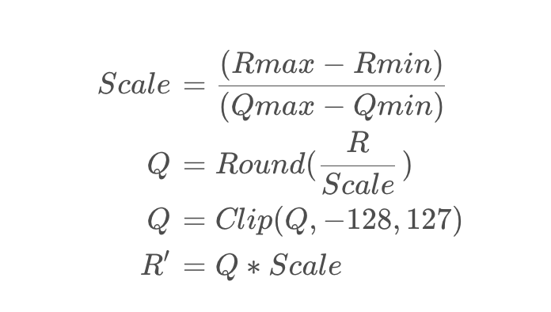
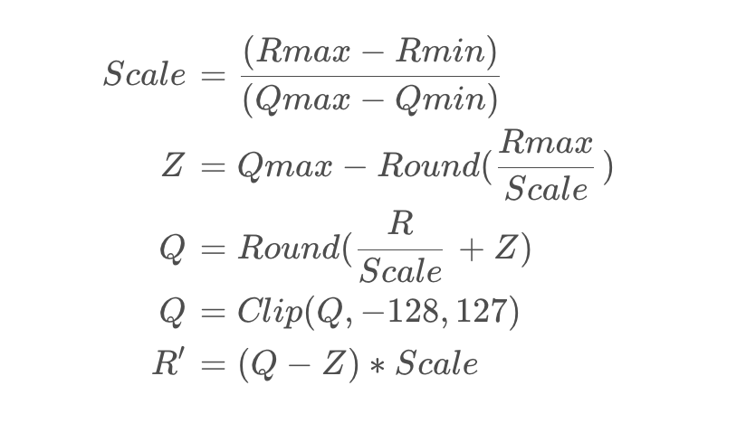

### 1. 引出问题
正常模型量化的流程是**计算Scale=>量化=>截断=>反量化**，会出现的问题，就是量化截断操作后，反量化获取的值
与原来的值又一个较大的误差，这对模型的精度影响非常大。  

量化的流程中的计算公式如下：

### 2. 非对称量化
#### 2.1 动态返回量化
通过引入偏移量Z可以解决，具体公式如下

**动态范围量化**中的校准过程(Calibration)。它属于非对称量化的一种形式。由于量化参数(比如量化因子Scale)是通
过数据集的统计量来估计的，因此称为动态范围量化。它能够减少量化误差的原因是，引入了一个偏移量Z，使得量化后的数值
在更小的范围内，进而减小量化误差。同时，偏移量Z的计算使得量化后的最大值Rmax落在了Qmax上，保证了最大值的精度。

其中，Qmax是量化后的取值范围的最大值，Round(Rmax / Scale)是Rmax映射为量化后取值范围的最大值后再取整的结果。
实际上，偏移量Z就是实数空间的最大值Rmax与量化空间的最大值Qmax对齐的结果。

### 3. 对称量化
**对称量化**是一种量化方法，其中量化步长在正负之间对称，即使得所有值域范围内的数据点都在对称轴的两侧，这样可以
避免出现由于量化导致的误差。

量化公式如下：

在对称量化中还存在一个问题，比如目前原始数组中有1000个点分布在[-1,1]之间，突然有个离散点分布在100处，此时做对称
量化时Scale会被调整得很大，使得上下限超出[-127,127]的范围，从而导致量化误差增大，对精度的影响也会相应增大。

因此，在对称量化中，需要谨慎处理数据中的极端值，以避免对量化精度造成不利的影响。  
**在tensorRT中的INT8量化使用的方法就是对称量化**

### 4. 非对称量化 vs 对称量化

#### 对称量化的优点
* 没有偏移量，可以降低计算量
* 分布在正负半轴的权值数值均可被充分利用，具有更高的利用率
* 对于深度学习模型，可以使用int8类型的乘法指令进行计算，加快运算速度
* 能够有效的缓解权值分布在不同范围内的问题

#### 对称量化的缺点
* 对于数据分布在0点附近的情况，量化的位数可能不够
* 数据分布的范围过于分散，如果缺乏优秀的统计方法和规律，会导致量化效果不佳
* 精度下降，可能引起浮点数向整数下采样时的精度损失

#### 非对称量化的优点
* 通过偏移量可以保证量化的数据分布在非负数范围内，可以使得分辨率更高
* 适合数据分布范围集中的情况
* 精度保留，可能在保持模型精度的同时进行量化，可以减少量化引起的误差

#### 非对称量化的缺点
* 对于偏移量的计算需要额外的存储空间，增加了内存占用
* 偏移量计算需要加减运算，会增加运算的复杂度
* 对于深度学习模型，要使用int8类型的乘法指令进行计算，需要进行额外的偏置操作，增加运算量
